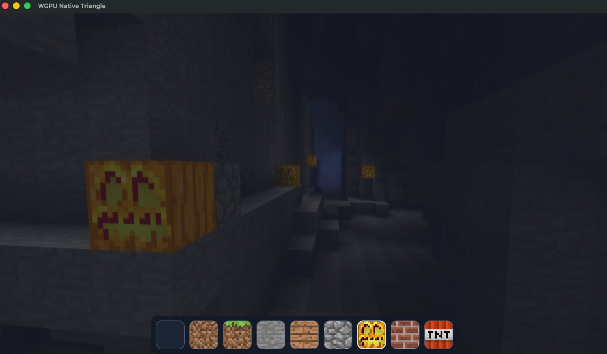
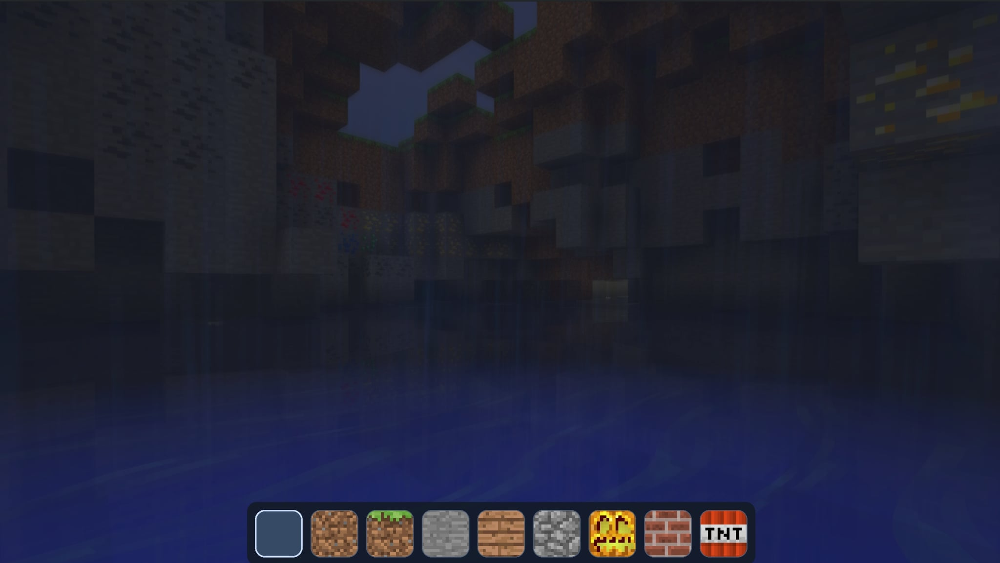
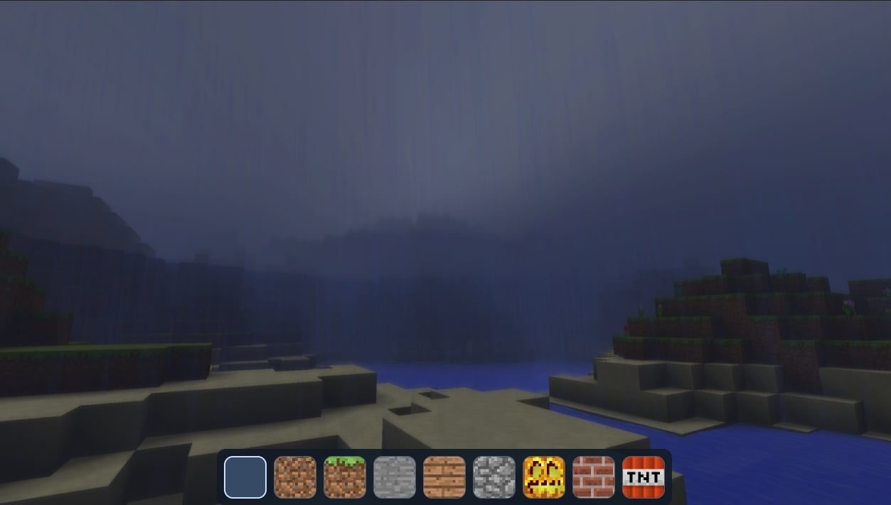

# wgpuvoxels

Voxel engine using WebGPU.
The same codebase runs as a native SDL3 app or in the browser via WASM.

Online demo: https://dawdmaow.github.io/wgpuvoxels/

# Features

- terrain generation using GPU compute shaders
- dig/place voxels
- UI hotbar selection for different voxel types
- water and swimming
- falling sand
- TNT explosions
- rain shader
- layered clouds (2.5D)
- planar water reflections
- post-processing (bloom, depth of field, underwater distortion, fog)

## Web build

```bash
./build_web.sh
```

## Controls

| Input       | Action                                                |
| ----------- | ----------------------------------------------------- |
| Mouse       | Look around                                           |
| Left click  | Break block (TNT: arms for explosion when applicable) |
| Right click | Place selected block                                  |
| Wheel / 1-9 | Hotbar slot                                           |
| WASD        | Move                                                  |
| Space       | Jump; swim up in water; move up in noclip             |
| Shift       | Swim down in water; move down in noclip               |
| F1          | Toggle noclip                                         |
| F2          | Toggle chunk bounds debug                             |
| F3          | Toggle rain                                           |
| F4          | Toggle bloom                                          |
| F5          | Toggle clouds                                         |
| F6          | Toggle fog                                            |
| F7          | Toggle FXAA                                           |
| F8          | Toggle depth of field                                 |

**SDL3 (desktop):** ESC releases mouse capture when captured; press ESC again to quit when the cursor is free.

## Screenshots



